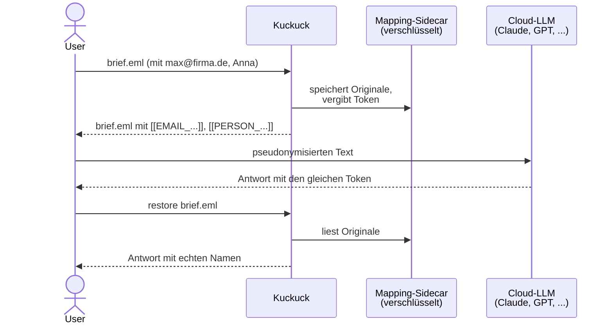

# Kuckuck 🐦

[](LICENSE)


Lokale Pseudonymisierung personenbezogener Daten in Textdateien, **bevor** du sie an Cloud-LLMs gibst.

## Wie funktioniert das?



Der Master-Key bleibt lokal, der Mapping-Sidecar (`*.kuckuck-map.enc`) ist AES-GCM-verschlüsselt.
Ohne Key keine Rückführung — siehe Abschnitt "Umkehrbarkeit".

Was Kuckuck **ist**:

- Ein lokales CLI- und Library-Tool in Python.
Keine Cloud, keine Telemetrie.
- Ein einfacher Weg, E-Mails, Jira-Tickets und Confluence-Exporte pseudonymisieren zu lassen, bevor du sie an Claude, ChatGPT oder ein anderes Cloud-LLM gibst.
- Deterministisch: derselbe Name bekommt - über Dokumente und zwischen Teammitgliedern mit gleichem Key - denselben Token.

Was Kuckuck **nicht ist**:

- Keine DSGVO-Anonymisierung im Sinne von Erwägungsgrund 26.
Pseudonymisierte Daten bleiben personenbezogen.
Kläre den Einsatz mit deinem DSB ab, bevor du Kuckuck produktiv benutzt.
- Kein Ersatz für Datenminimierung.
Kontextuelle Re-Identifikation (Rolle + Ort + Datum) ist möglich und nicht Aufgabe des Tools.

## Umkehrbarkeit ist an den Key gebunden

> **Nur mit dem passenden `.kuckuck-key` lässt sich die Pseudonymisierung rückgängig machen.**
> Ohne Key ist der Output wie ein Einweg-Hash: der Mapping-Sidecar (`*.kuckuck-map.enc`) ist AES-GCM-verschlüsselt und ohne Masterkey kryptographisch unlesbar.

Das heißt konkret:

- Wer den Key hat, kann jedes Mapping entschlüsseln und jeden Token zurück auf das Original führen.
- Wer den Key verloren hat, hat auch den Zugriff auf die Originalnamen unwiderruflich verloren.
- Wer den Key **weitergibt**, gibt damit die Fähigkeit weiter, alle bisher pseudonymisierten Dokumente zu deanonymisieren.

Lege den Key deshalb wie ein Passwort an und teile ihn nur über einen sicheren Kanal (Passwort-Manager wie 1Password/Bitwarden).

### Ist „Key wegwerfen" gleich Anonymisierung?

Jein - die ehrliche Antwort ist: es kommt auf drei Bedingungen an.

Kuckuck ist per Definition ein **Pseudonymisierungs**-Tool nach DSGVO Art. 4 Nr. 5.
Pseudonymisierte Daten bleiben personenbezogene Daten, solange die Zuordnung wiederherstellbar ist.
Damit der pseudonymisierte Output als **anonymisiert** im Sinne von Erwägungsgrund 26 gelten kann, müssen *alle drei* folgenden Punkte erfüllt sein:

1. **Alle Kopien des Keys sind zerstört** - im Passwort-Manager, in allen Backups, in allen Teammitglieder-Kopien, in allen CI-Caches.
Solange irgendwo eine Kopie existiert, bleibt die Rückführung möglich und der Output bleibt pseudonymisiert, nicht anonymisiert.
2. **Alle Kopien des Mappings sind zerstört** - oder zumindest alle Kopien der Originaldokumente, aus denen die Mappings rekonstruiert werden könnten.
Wer die Original-E-Mail noch hat, kann per re-Pseudonymisierung die Zuordnung rekonstruieren.
3. **Kontextuelle Re-Identifikation ist praktisch nicht möglich** - der pseudonymisierte Text enthält keine Kombinationen aus Rolle, Ort, Datum, Projektnamen, die eine Einzelperson eindeutig identifizieren.
Kurze, generische Texte sind hier sicherer als lange, kontextreiche.

Nur wenn alle drei Bedingungen zusammen erfüllt sind, ist der verbleibende Text nach DSGVO-Maßstab anonymisiert.
In der Praxis ist Bedingung 3 die schwierigste: „der Geschäftsführer eines mittelständischen Bäckereibetriebs in 49716 Meppen" ist nach Weggabe des Keys zwar ohne Mapping nicht mehr über den Token rückführbar, aber weiterhin einer realen Person zuordenbar.

**Kurz:** Den Key wegzuwerfen reicht in den meisten realistischen Szenarien nicht aus, um aus Pseudonymisierung eine Anonymisierung zu machen.
Behandle den pseudonymisierten Output deshalb weiterhin als personenbezogenes Datum, bis dein DSB für dein konkretes Szenario etwas anderes feststellt.

## Was wird erkannt?

| Entitätstyp | Erkennung |
|---|---|
| E-Mail-Adressen | Regex + `email-validator` für Vetting |
| Telefonnummern | [`phonenumbers`](https://pypi.org/project/phonenumbers/) (Default-Region: DE) |
| Jira-/Confluence-Handles | Regex - `@user.name`, `[~accountid:...]`, `[~user]` |
| Denylist-Einträge | Kunden-/Projektnamen aus einer Datei |
| Personen-Namen | Optional via [GLiNER](https://github.com/urchade/GLiNER) (`urchade/gliner_multi-v2.1`), Opt-in per `--ner` |

Die Regex-Detektoren decken die häufigsten Datenquellen (Mail-Signaturen, Jira-Reporter, Confluence-Mentions) ohne ML ab.
Klarnamen ohne Handle werden erst beim Opt-in zum NER-Detektor erfasst.

### Unterstützte Eingabeformate

Kuckuck wählt das passende Format automatisch über die Datei-Endung; `--format` setzt es explizit.

| Format | Endung | Was passiert |
|---|---|---|
| Plain Text | beliebig (`.txt`, kein Match) | Ganzer Inhalt geht durch die Detektoren - Default |
| E-Mail | `.eml` | Header bleiben unangetastet, nur der Body wird verarbeitet; deutsche Signatur-Trigger und Quoted-Replies werden separat bearbeitet |
| Outlook | `.msg` | Body wird extrahiert (Reihenfolge: HTML > RTF > Plain), Anhänge bleiben aussen vor (Warnung) |
| Markdown | `.md` / `.markdown` | YAML-Frontmatter, Code-Blocks und Inline-Code werden nicht angefasst; Prosa, Listen, Footnotes und Reference-Links schon |
| XML | `.xml` / `.html` | Text-Knoten und Attribut-Werte gehen durch die Detektoren; Tag-Struktur, Namespaces und CDATA bleiben erhalten |

## Installation

### Als Python-Package

```bash
# Library-Nutzung
pip install kuckuck

# Zusätzlich die CLI installieren
pip install "kuckuck[cli]"

# CLI plus optionaler GLiNER-Personen-Detektor (zieht torch + gliner)
pip install "kuckuck[cli,ner]"
```

### Als Standalone-Binary

Lade dir die plattformspezifische Binary von der [Releases-Seite](https://github.com/Hochfrequenz/kuckuck/releases/latest).
Es gibt vier Varianten je Plattform — zwei reine CLI-Varianten und zwei MCP-Server-Varianten:

| Variante | Dateiname | Größe | CLI | MCP-Server | NER |
|---|---|---|---|---|---|
| CLI Slim | `kuckuck_windows_<ver>.exe`, `kuckuck_macos_arm64_<ver>` | ~ 30 MB | ja | nein | nein |
| CLI NER | `kuckuck_windows_ner_<ver>.exe`, `kuckuck_macos_arm64_ner_<ver>` | ~ 300 MB | ja | nein | ja |
| MCP Slim | `kuckuck-mcp_windows_<ver>.exe`, `kuckuck-mcp_macos_arm64_<ver>` | ~ 43 MB | nein | ja | nein |
| MCP NER (empfohlen für Coding-Assistenten) | `kuckuck-mcp_windows_ner_<ver>.exe`, `kuckuck-mcp_macos_arm64_ner_<ver>` | ~ 305 MB | nein | ja | ja |

Die CLI-Varianten startest du mit `kuckuck <file>`; sie enthalten keinen MCP-Server.
Die MCP-Varianten sind stdio-Server für MCP-Clients (Claude Code, opencode, Claude Desktop) — siehe [`integrations/mcp/README.md`](integrations/mcp/README.md) für die Setup-Anleitung pro Client.
Die `_ner`-Varianten bringen zusätzlich gliner + CPU-only torch mit, sodass die PERSON-Namen-Erkennung ohne separaten Python-Install funktioniert (Modell wird einmalig via `kuckuck fetch-model` bzw. das `kuckuck_fetch_model` MCP-Tool nachgeladen).

Nach dem Download umbenennen (optional) und Quarantäne-Attribut entfernen:

```bash
# macOS
mv kuckuck_macos_arm64_v0.1.0 kuckuck
xattr -c kuckuck
chmod +x kuckuck
```

## Key anlegen

Kuckuck pseudonymisiert mit einem geheimen Master-Key, aus dem HMAC- und Verschlüsselungs-Subkeys abgeleitet werden.
Lege ihn einmalig an:

```bash
kuckuck init-key           # schreibt ~/.config/kuckuck/key (User-scoped)
kuckuck init-key --project # alternativ ein Key pro Projekt: ./.kuckuck-key
```

### Key teilen

Kopiere den Inhalt in euren Passwort-Manager (1Password, Bitwarden, …) und verteile ihn dort.
Mit dem gleichen Key bekommt derselbe Name bei jedem Teammitglied denselben Token - ihr könnt pseudonymisierte Dokumente untereinander diskutieren.

### Such-Reihenfolge (höchste → niedrigste Präferenz)

1. CLI-Flag `--key-file PATH`
2. Env-Var `KUCKUCK_KEY_FILE` (auch aus `.env`)
3. `$PWD/.kuckuck-key`
4. `~/.config/kuckuck/key`

### `.gitignore` für Key und Mapping

Key-Datei und Mapping-Sidecar dürfen **niemals** in ein Repo committet werden.
Füge diese Zeilen in deine `.gitignore` ein:

```gitignore
# Kuckuck - Schlüssel und verschlüsseltes Mapping (nie committen!)
.kuckuck-key
*.kuckuck-key
*.kuckuck-map.enc

# Optional: pseudonymisierte Dateien, wenn du nur das Original im Repo willst
*.pseudonymized.*
```

`*.kuckuck-map.enc` ist zwar AES-GCM-verschlüsselt, ein Commit ins Repo würde aber den Blast-Radius eines versehentlich geleakten Keys massiv vergrößern - besser gar nicht erst committen.

## CLI-Nutzung

**Einfachster Fall - Datei direkt ersetzen:**

```bash
kuckuck brief.txt
# -> brief.txt enthält jetzt [[EMAIL_a7f3b2c1]] statt max@firma.de
# -> brief.txt.kuckuck-map.enc liegt daneben (verschlüsseltes Mapping)
```

**Rückführung nach LLM-Roundtrip:**

```bash
kuckuck restore brief.txt
# -> brief.txt ist wieder original
```

**Batch-Verarbeitung:**

```bash
kuckuck docs/*.md
```

**Ohne Überschreiben (Original bleibt):**

```bash
kuckuck brief.txt --output-dir out/
```

**Vorschau (nichts schreiben):**

```bash
kuckuck brief.txt --dry-run
```

**Mit Denylist für Kunden-/Projektnamen:**

```bash
# denylist.txt - eine Zeile pro Eintrag, # sind Kommentare
echo "Kunde Alpha GmbH" >> denylist.txt
echo "Projekt Zugspitze" >> denylist.txt

kuckuck brief.txt --denylist denylist.txt
```

**Format-aware Verarbeitung (E-Mail, Markdown, XML):**

```bash
# Auto-Detection per Endung
kuckuck mail.eml          # Header bleiben, Body wird pseudonymisiert
kuckuck notiz.md          # Code-Blocks und Inline-Code bleiben unangetastet
kuckuck export.xml        # Tag-Struktur bleibt, Text und Attribute gehen durch

# Explizit setzen, wenn die Endung nicht passt
kuckuck irgendwas --format eml
kuckuck doc.txt --format md
```

Format-Auto-Detection: `.eml -> eml`, `.msg -> msg`, `.md`/`.markdown -> md`, `.xml`/`.html -> xml`, alles andere -> `text`.

**Sequenzielle Tokens statt HMAC (kürzer im Output, aber nicht cross-doc-stabil):**

```bash
kuckuck brief.txt --sequential-tokens
# -> [[EMAIL_1]], [[EMAIL_2]], ... pro Dokument
```

**Mit NER-Detektor für Personennamen:**

```bash
# einmalig: Modell laden (ca. 1.1 GB ins ~/.cache/kuckuck/models/)
pip install "kuckuck[ner]"
kuckuck fetch-model

# danach beliebig oft - vollständig offline
kuckuck brief.txt --ner
# -> "Max Mustermann" wird zu [[PERSON_a7f3b2c1]]
```

Der NER-Detektor läuft erst, wenn er mit `--ner` aktiviert wird, damit die Default-Pipeline kein torch laden muss.
Ohne installiertes `kuckuck[ner]`-Extra oder ohne lokales Modell beendet sich `kuckuck --ner` mit Exit-Code 7 und einem Hinweis.

**Mapping inspizieren (für Debugging, gibt Klartext aus):**

```bash
kuckuck inspect brief.txt.kuckuck-map.enc
```

**Alle Subkommandos:**

```
kuckuck <file>...          Pseudonymisieren (Default)
kuckuck run <file>...      Explizit (identisch zur Default-Form), nimmt --ner
kuckuck restore <file>...  Mapping anwenden, Original wiederherstellen
kuckuck init-key           Neuen Master-Key generieren
kuckuck fetch-model        GLiNER-Modell laden (nur mit kuckuck[ner])
kuckuck inspect <map>      Verschlüsseltes Mapping als Klartext dumpen
kuckuck list-detectors     Alle registrierten Detektoren zeigen
kuckuck version            Version ausgeben
```

## Binary-Nutzung

Die Binaries verhalten sich identisch zur pip-installierten CLI.
Beispiel Windows PowerShell:

```powershell
.\kuckuck_windows.exe init-key
.\kuckuck_windows.exe brief.txt
.\kuckuck_windows.exe restore brief.txt
```

Beispiel macOS:

```bash
./kuckuck_macos_arm64 init-key
./kuckuck_macos_arm64 brief.txt
./kuckuck_macos_arm64 restore brief.txt
```

## Library-Nutzung

```python
from pathlib import Path
from kuckuck import (
    Mapping,
    build_default_detectors,
    load_default_key,
    load_mapping,
    pseudonymize_text,
    restore_text,
    save_mapping,
)

key = load_default_key()
detectors = build_default_detectors(denylist=["Kunde Alpha GmbH"])

source = Path("brief.eml")
text = source.read_text(encoding="utf-8")

# Bei vorhandenem Mapping merge-reload, sonst leer starten
map_path = source.with_suffix(source.suffix + ".kuckuck-map.enc")
mapping = load_mapping(key, map_path) if map_path.is_file() else Mapping()

result = pseudonymize_text(text, key, detectors, mapping=mapping)
source.write_text(result.text, encoding="utf-8")
save_mapping(key, result.mapping, map_path)

# Später: restore
restored = restore_text(source.read_text(encoding="utf-8"), result.mapping)
```

## Integration mit KI-Assistenten

Wenn du Claude Code, Cursor, GitHub Copilot, Codex oder ähnliche Coding-Assistenten benutzt, die Dateien in deinem Repo lesen können, kannst du ihnen beibringen, Dokumente mit personenbezogenen Daten **immer** zuerst durch Kuckuck zu schicken.
Je nach Client gibt es vier Schutzebenen, die sich stapeln lassen:

| Stufe | Mechanismus | Client-Support | Wann sinnvoll |
|---|---|---|---|
| 1 | Konvention via `AGENTS.md` / `CLAUDE.md` | alle | Minimal-Setup, wenn nichts weiter geht |
| 2 | [Claude-Code-Hook](#claude-code-pretooluse-hook) (dieses Repo) | nur Claude Code | Defense-in-Depth: blockt `Read(*.eml)` auch ohne MCP |
| 3 | [MCP-Server](#mcp-server-empfohlen) (dieses Repo) | Claude Code, Cursor, Cline, Zed, opencode, Claude Desktop | Empfohlen - aktive `kuckuck_pseudonymize`-Tool-Calls |
| 4 | opencode-Plugin | opencode | Folge-Issue; macht dasselbe wie (2), nur für opencode |

Best-Practice mit Claude Code: **(1) + (2) + (3) kombinieren**.
MCP-Server als aktive Schnittstelle, Hook als passiver Safety-Net, AGENTS.md als letzte Verteidigung.

### MCP-Server (empfohlen)

Kuckuck kann sich als Model Context Protocol Server registrieren.
Damit ruft der Assistent `kuckuck_pseudonymize` und `kuckuck_restore` als native MCP-Tools auf, ohne pro-Client-Hook und ohne dass du dich auf AGENTS.md-Konventionen verlassen musst.

```bash
pip install "kuckuck[mcp]"
# danach den MCP-Server in deinem Client eintragen
```

Setup-Anleitungen für Claude Code, opencode und Claude Desktop: siehe [`integrations/mcp/README.md`](integrations/mcp/README.md).
Beispiel-Configs liegen daneben.

### Claude-Code-PreToolUse-Hook

Zusätzlich zum MCP-Server kann Claude Code einen PreToolUse-Hook aufrufen, der `Read`, `Edit` und `Grep` auf `*.eml`/`*.msg`-Dateien abfängt und sie vorher durch Kuckuck schickt.
Der Hook ist Defense-in-Depth: auch wenn das Modell vergisst, das `kuckuck_pseudonymize` MCP-Tool aufzurufen, landet kein Klartext-PII im Claude-Kontext.

```bash
pip install "kuckuck[cli]"
apt install jq             # bzw. 'brew install jq', 'winget install jqlang.jq'
kuckuck install-claude-hook
```

Das CLI-Kommando legt das Shell-Script (oder `.ps1` unter Windows) unter `.claude/hooks/kuckuck-pseudo.sh` ab und merged den Hook-Eintrag idempotent in `.claude/settings.json`.
Setup, Fail-Closed-Semantik und Troubleshooting: siehe [`integrations/claude-code/README.md`](integrations/claude-code/README.md).

### AGENTS.md / CLAUDE.md Snippet (Fallback)

Füge folgenden Abschnitt in deine `AGENTS.md` oder `CLAUDE.md` ein:

````markdown
## PII-Schutz für E-Mails, Tickets und Wiki-Exporte

Dateien mit personenbezogenen Daten (E-Mails, exportierte Jira-Tickets, Confluence-Seiten, Chat-Logs) dürfen **nicht im Original** gelesen oder an externe Modelle gesendet werden.
Vor der Analyse immer durch Kuckuck pseudonymisieren:

```bash
kuckuck <file>                 # ersetzt die Datei in-place
kuckuck restore <file>         # Original wiederherstellen, nachdem die
                               # Analyse abgeschlossen ist
```

Erkennung:
- `[[EMAIL_...]]` - E-Mail-Adresse
- `[[PHONE_...]]` - Telefonnummer
- `[[HANDLE_...]]` - Jira-/Confluence-Mention
- `[[TERM_...]]` - Eintrag aus `denylist.txt` (Kunden/Projekte)
- `[[PERSON_...]]` - Personenname (nur mit `kuckuck --ner`, vorher `kuckuck fetch-model` einmalig)

Eingabeformate, die Kuckuck strukturiert erkennt:
- `.eml` (E-Mail mit Headern + Body, Signatur-Trigger werden separiert)
- `.msg` (Outlook, HTML > RTF > Plain Body, Anhänge bleiben aussen vor)
- `.md` (Markdown, Code-Blocks und YAML-Frontmatter bleiben unangetastet)
- `.xml` / `.html` (Tag-Struktur bleibt, Text und Attribute gehen durch)
- alles andere als Plain-Text

Gleiche Namen bekommen den gleichen Token, auch dokumentübergreifend.
Du (Assistent) darfst bei der Analyse annehmen, dass `[[HANDLE_abc]]` mit gleichem Suffix in mehreren Dokumenten dieselbe Entität ist - ohne den Klartext zu benötigen.

Regeln:
1. Vor dem ersten Read einer `.eml` / `.msg` / exportierten Jira-/Confluence-Datei: `kuckuck <file>` aufrufen.
2. In Commits niemals die `*.kuckuck-map.enc`-Dateien oder `.kuckuck-key` mit-committen (sind in `.gitignore`).
3. Tokens in deinen Antworten **nicht** auflösen - der Nutzer führt den Restore-Schritt lokal aus.
````

### System-Prompt für Cloud-LLMs (Direct API)

Wenn du pseudonymisierten Text per API an Claude, GPT oder Gemini schickst, ergänze deinen System-Prompt:

> Im Benutzertext erscheinen Platzhalter der Form `[[TYP_hash]]`, z.B. `[[EMAIL_a7f3b2c1]]` oder `[[HANDLE_b1e2c3d4]]`.
> Diese Token sind pseudonymisierte personenbezogene Daten.
> **Übernimm sie wörtlich und unverändert** in deine Antwort.
> **Flektiere sie nicht** (kein Genitiv-s anhängen, keine Kleinschreibung, keine Umbenennung).
> Gleiche Token-IDs im gesamten Text beziehen sich auf dieselbe Entität.

## Erkannte Grenzen

- **Kontextuelle Re-Identifikation:** „Der Geschäftsführer eines mittelständischen Bäckereibetriebs in 49716 Meppen" ist praktisch eindeutig - Kuckuck ersetzt Namen, nicht Kontexte.
Kurze Texte sind sicherer als lange.
- **Seltene Namen / Initialen:** Die Regex-Pipeline kennt keine Namen.
Klarnamen ohne Handle landen nur dann im Mapping, wenn der NER-Detektor (`--ner`) aktiviert ist - GLiNER ist multilingual und auf deutsche Personennamen vortrainiert, hat aber bei sehr kurzen oder seltenen Vornamen Recall-Lücken.
- **Formate:** Plain-Text plus format-aware Verarbeitung für `.eml`, `.msg`, Markdown und XML/HTML (siehe Tabelle oben).
Outlook-`.msg`-Dateien geben keinen byte-faithful Round-Trip zurück - nur den pseudonymisierten Body als Plain-Text, weil das compound-document Re-Roundtrippen nicht das Ziel ist.
Anhänge in `.msg` werden nicht angefasst.
- **Linkage-Risiko:** Durch die Cross-Document-Konsistenz kann ein Cloud-LLM-Provider - wenn er Logs speichert - Tokens über Sessions verketten.
Für Anthropic/OpenAI B2B mit ausgeschalteter Trainings-Nutzung in der Praxis irrelevant, im eigenen Compliance-Kontext aber evaluieren.

## Development

Das Repo folgt dem Hochfrequenz-Python-Template.
Tox orchestriert alle Entwickler-Workflows:

```bash
tox -e dev          # komplettes Dev-Environment erzeugen
tox -e tests        # Unit- und Integrationstests (pytest + syrupy + hypothesis)
tox -e snapshots    # Snapshots regenerieren (--snapshot-update)
tox -e linting      # pylint (10/10 nötig)
tox -e type_check   # mypy --strict
tox -e coverage     # Coverage-Report (>= 80 %)
tox -e build_executable        # PyInstaller Windows/Linux
tox -e build_executable_macos  # PyInstaller macOS + ad-hoc codesign
```

Die Dev-Environment-Einrichtung und PyCharm/VS-Code-Integration sind im [Template-README](https://github.com/Hochfrequenz/python_template_repository) dokumentiert.

## Lizenz

MIT - siehe das LICENSE-File bei Inklusion im Release.
